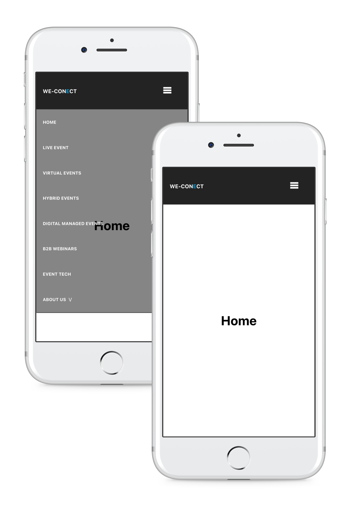
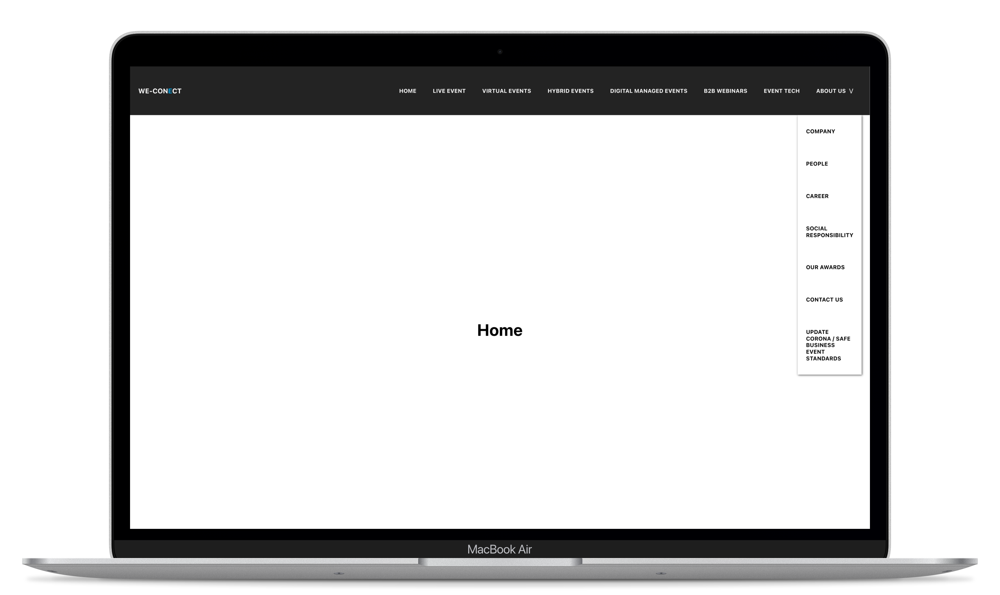
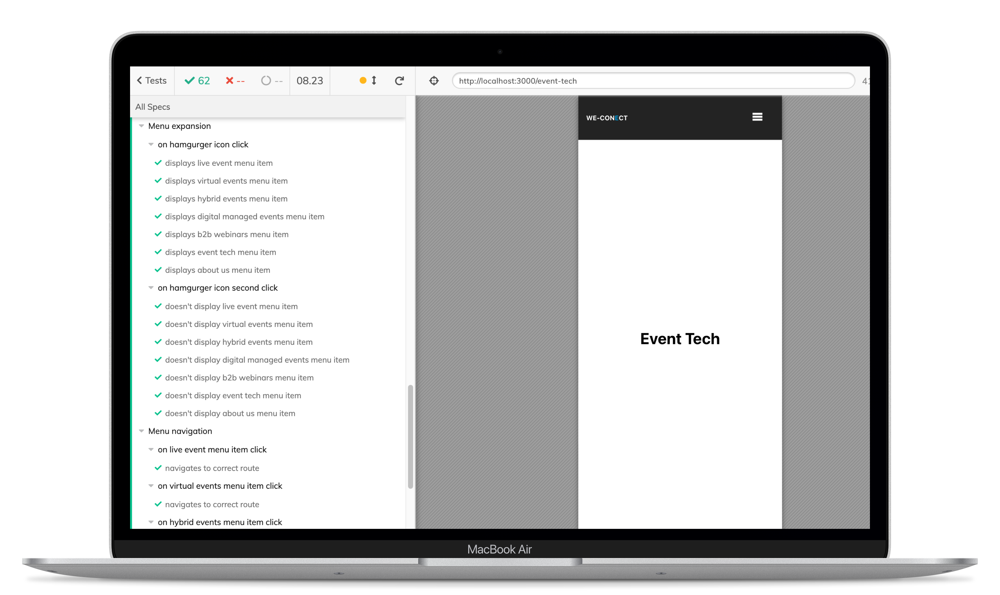
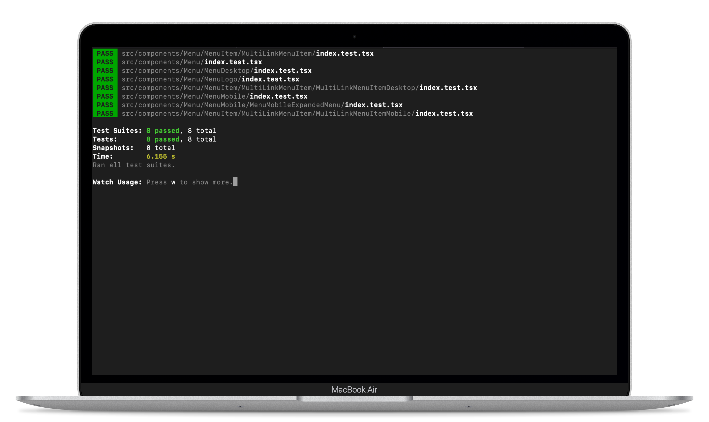

# We-Conect Menu Bar

This project has been delivered as a part of "We-Conect Challenge". All features have been manually tested by human and heavily inspected for responsiveness. Codebase is covered with automated end-to-end tests using Cypress.

## Mobile UX

In order to have the navigation links displayed we need to press the hamburger menu icon first. This decision adds one more step to the whole process but keeps the UI clean.

## Desktop UX

When we have wider viewports, we are able to display the navigation links inside navigation bar right away. Multiple links will be displayed in a paper-styled popover after the click on a particular menu item.

## Build Steps

After cloning the project, navigate to the project directory and then:

1. Run `yarn` or `yarn install`. This installs all the neccessary dependencies for a project.
2. Run `yarn start`. This starts the app in development mode.
3. Try to break the navigation bar.

## Testing

Open the command line, navigate to the project directory and then:

1. Run `node_modules/.bin/cypress open` to open the Cypress dashboard for end-to-end testing.

   

2. Run `yarn test` to check the unit test coverage.

   

## About

Application has been developed using [React](https://reactjs.org/) & [Typescript](https://www.typescriptlang.org/), state is managed using [Context API](https://reactjs.org/docs/context.html). End-to-end testing is achieved using [Cypress](https://www.cypress.io/) and mockups have been created using [Figma](https://www.figma.com/). Time needed for implementation and manual + automated testing the feature was about 2 days.

To we.CONECT Global Leaders GmbH by Luka.
